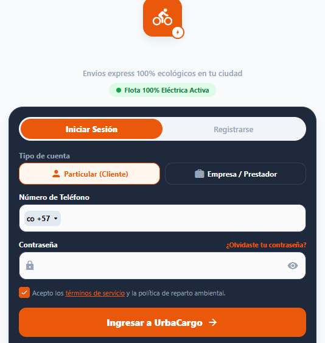
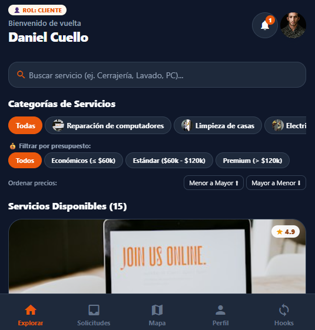
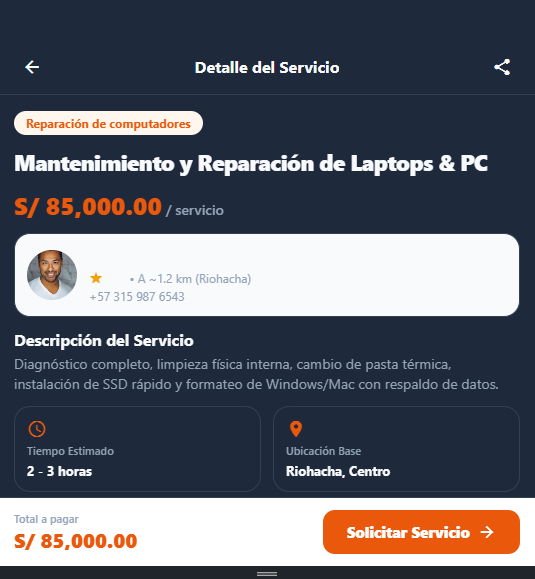
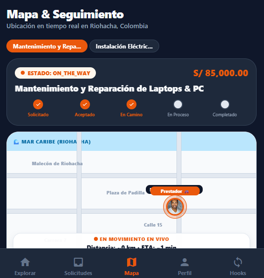
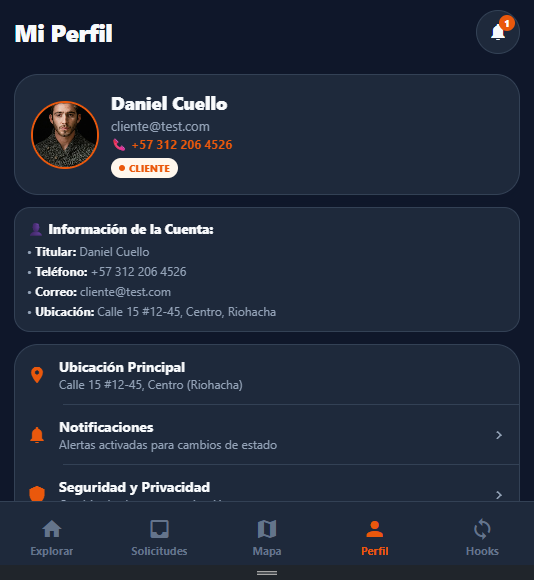
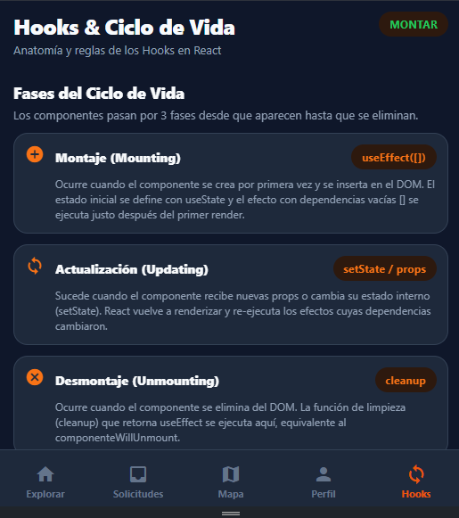
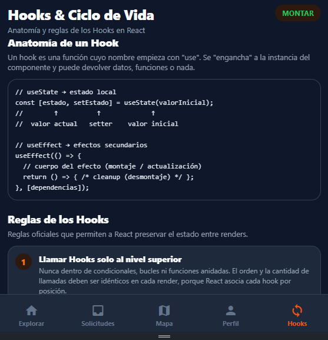
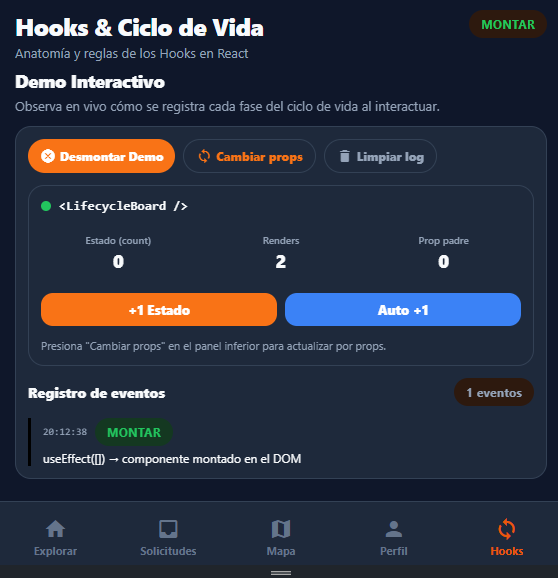

# 🚀 UrbaCargo - Plataforma Móvil de Servicios y Logística Express


**UrbaCargo** es una plataforma móvil multiplataforma (Android, iOS y Web) construida con **Expo SDK 54** y **expo-router**. Permite conectar a clientes con prestadores de servicios en **Riohacha, Colombia**, ofreciendo búsqueda inteligente, cotización por presupuestos, solicitud interactiva y rastreo con mapa en tiempo real con simulación de movimiento.

---

## 📸 Capturas de Pantalla de la Aplicación

### 1. 🔐 Pantalla de Inicio & Autenticación (Login)
Pantalla de entrada por defecto con temática en **color naranja**, selectores de tipo de cuenta (`Particular / Cliente` vs `Empresa / Prestador`), número de teléfono con selector `+57`, contraseña con ojo de visibilidad y validación estricta de términos de servicio.

<!--
  CAPTURA 1 — TOMAR EN: sitio web UrbaCargo (npx expo start y luego tecla "w").
  Al abrir la app aparece directamente el LOGIN naranja (redirige por defecto).
  Captura la pantalla completa: selectores Particular/Cliente vs Empresa/Prestador,
  campo de teléfono +57, contraseña con el ojo de visibilidad y términos de servicio.
-->


---

### 2. 🏠 Explorar & Catálogo de Servicios (Vista Cliente)
Panel principal para el usuario **Daniel Cuello** con barra de búsqueda instantánea en vivo, carrusel de categorías con miniaturas, filtro por rangos de precio (Económicos ≤ $60k, Estándar $60k-$120k, Premium > $120k) y 15 servicios disponibles en Riohacha.

<!--
  CAPTURA 2 — TOMAR EN: la misma app web ya iniciada.
  Inicia sesión como CLIENTE: correo (cualquiera) y teléfono 3122064526 o el botón
  de cliente. Caerás en la pestaña "Explorar" (primera, icono de casa).
  Captura el catálogo: barra de búsqueda, carrusel de categorías y servicios con precio.
-->


---

### 3. 📄 Detalle del Servicio & Solicitud
Vista detallada con descripción completa del servicio, rating de 4.9 estrellas, datos de contacto del prestador **Carlos Mendoza**, tiempo estimado de atención, mapa preview de ubicación en Riohacha y botón **"Solicitar Servicio"**.

<!--
  CAPTURA 3 — TOMAR EN: la misma pestaña "Explorar".
  Haz clic en el primer servicio ("Mantenimiento y Reparación de Laptops & PC",
  prestador Carlos Mendoza) para abrir su detalle (ruta /service/...).
  Captura la vista completa: descripción, rating 4.9, contacto del prestador,
  tiempo estimado, mapa preview de Riohacha y botón "Solicitar Servicio".
-->


---

### 4. 🗺️ Mapa de Rastreo en Tiempo Real (Riohacha)
Línea de tiempo del ciclo de vida (`PENDING` ➔ `ACCEPTED` ➔ `ON_THE_WAY` ➔ `IN_PROGRESS` ➔ `COMPLETED`). Incluye el mapa dinámico de Riohacha con marcadores interactivos del cliente y prestador, polyline de ruta, efecto de pulso animado en movimiento y tacómetro con distancia en kilómetros y ETA.

<!--
  CAPTURA 4 — TOMAR EN: la pestaña "Mapa" (tercera, icono de mapa 🗺️).
  Ya existe una solicitud en estado EN CAMINO (Carlos Mendoza → Calle 15), así que
  verás la línea de tiempo PENDING➔ACCEPTED➔ON_THE_WAY➔IN_PROGRESS➔COMPLETED,
  el mapa dinámico de Riohacha con marcadores y ruta, el pulso en movimiento
  y el tacómetro con distancia/ETA. Captura cuando el marcador se vea centrado.
-->


---

### 5. 👤 Perfil del Usuario
Vista oficial del perfil de **Daniel Cuello** con teléfono **3122064526**, fotografía HD de hombre trigueño, rol de cuenta, ubicación base en Riohacha y accesos funcionales a Notificaciones y Seguridad.

<!--
  CAPTURA 5 — TOMAR EN: la pestaña "Perfil" (cuarta, icono de persona 👤).
  Captura el perfil de Daniel Cuello completo: tarjeta con foto, teléfono
  3122064526, rol CLIENTE, información de la cuenta, opciones de Ubicación,
  Notificaciones y Seguridad.
-->


---

### 6. 🧠 Ciclo de Vida de los Hooks & Rules of Hooks (Nueva Pestaña Web)
Pestaña **Hooks** dentro de la navegación principal. Adapta a la web el tema de **Anatomía y Reglas de los Hooks**: explica las **3 fases del ciclo de vida** (Montaje, Actualización y Desmontaje), la anatomía de `useState` / `useEffect` y las **2 reglas oficiales**. Incluye un **demo interactivo en vivo** (`<LifecycleBoard />`) que monta, actualiza y desmonta un componente registrando cada fase en un log con horas y colores al pulsar "Montar Demo", "Desmontar Demo", "+1 Estado", "Auto +1" o "Cambiar props".

**Última actualización:** 21 de septiembre de 2026.

**📸 Capturas a tomar (3):**

<!--
  CAPTURA 1 — TOMAR EN: sitio web UrbaCargo (npx expo start y luego tecla "w").
  Abre la pestaña "Hooks" (barra inferior, icono circular de sincronización ⭮).
  Captura la PARTE SUPERIOR de la pantalla: encabezado "Hooks & Ciclo de Vida" +
  las 3 tarjetas de las Fases del Ciclo de Vida (Montaje, Actualización, Desmontaje).
-->


<!--
  CAPTURA 2 — TOMAR EN: misma pestaña "Hooks", desplazándote hacia abajo.
  Captura la sección "Anatomía de un Hook" (el bloque de código oscuro) junto con
  las tarjetas de las "Reglas de los Hooks" y la nota de eslint-plugin-react-hooks.
-->


<!--
  CAPTURA 3 — TOMAR EN: misma pestaña "Hooks", sección "Demo Interactivo".
  Antes de capturar, pulsa "Auto +1" o "Cambiar props" varias veces y luego
  "Desmontar Demo" para llenar el registro con los 3 colores (verde=MONTAR,
  azul=ACTUALIZAR, rojo=DESMONTAR). Captura el panel completo con el log en vivo.
-->


---

## 🛠️ Stack Tecnológico

| Tecnología | Versión / Descripción |
| --- | --- |
| **Expo** | `~54.0.36` |
| **React Native** | `0.81.5` |
| **React** | `19.1.0` |
| **Expo Router** | `~6.0.24` (File-based Routing) |
| **TypeScript** | `~5.9.2` |
| **Estilos & Iconos** | `@expo/vector-icons`, Theme Tokens Naranja |

---

## 🚀 Puesta en Marcha

### Requisitos
- **Node.js 20.19+**
- App **Expo Go** (SDK 54) o navegador web.

### Instalación e Inicio

```bash
# 1. Instalar dependencias
npm install

# 2. Iniciar servidor de desarrollo Metro
npm start

# 3. Abrir en la web
npm run web
```

---

## 📁 Estructura del Proyecto

```
UrbaCargo/
├── app/                        Rutas principales (expo-router)
│   ├── index.tsx               Guardia de inicio de app (Redirect a Login)
│   ├── login.tsx               Pantalla de Autenticación Naranja
│   ├── _layout.tsx             Root layout con AppProvider y ThemeProvider
│   ├── service/[id].tsx        Vista 2: Detalle y contratación de servicio
│   └── (tabs)/                 Navegación por pestañas
│       ├── _layout.tsx         Guardia de sesión y barra de pestañas
│       ├── index.tsx           Vista 1: Explorar servicios / Dashboard prestador
│       ├── shipments.tsx       Listado e historial de solicitudes
│       ├── track.tsx           Vista 3: Mapa de seguimiento en Riohacha
│       ├── profile.tsx         Perfil oficial de Daniel Cuello
│       └── hooks.tsx           Vista 6: Hooks y Ciclo de Vida (demo interactivo)
├── components/                 Componentes reutilizables
│   ├── interactive-map.tsx     Mapa SVG de Riohacha con animación en vivo
│   ├── notifications-modal.tsx Centro de notificaciones flotante
│   ├── lifecycle-demo.tsx      Componente demo del ciclo de vida (LifecycleBoard)
│   ├── screen.tsx              Contenedor de pantallas con Safe Area
│   └── ui/                     Badges, Botones, Tarjetas e Iconos
├── context/                    State Store reactivo en tiempo real
│   └── AppContext.tsx          Manejo de usuario, servicios, notificaciones y animación
├── data/                       Datos mock iniciales
│   └── mock-data.ts            15 servicios, categorías y usuarios de prueba
├── types/                      Definiciones del dominio TypeScript
│   └── services.ts             Modelos de Usuario, Servicio y Solicitud
└── constants/                  Tokens de diseño y paleta Naranja (#EA580C)
```

---

## 👥 Credenciales de Prueba

- **Cliente**: `cliente@test.com` / `3122064526` (Titular: **Daniel Cuello**)
- **Prestador (Empleado)**: `prestador@test.com` / `3159876543` (Titular: **Carlos Mendoza**)
